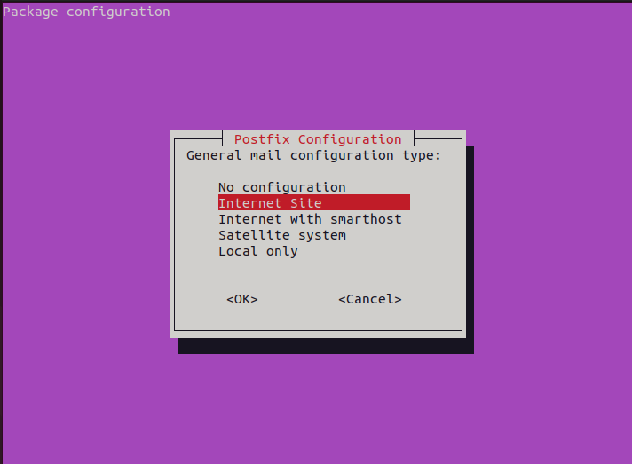
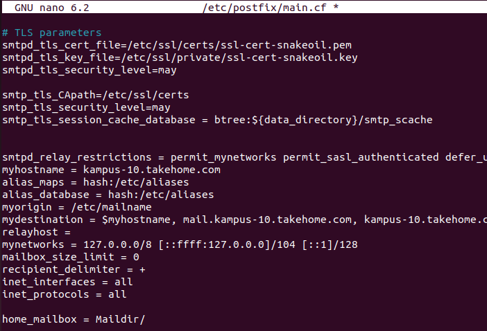
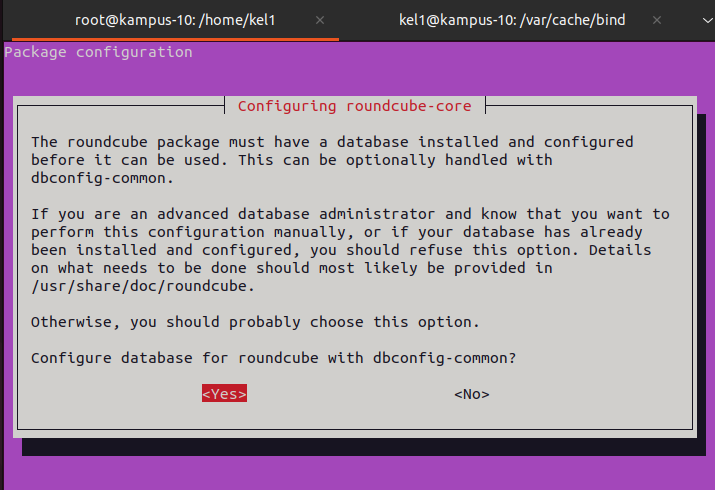

# Laporan Mail Server

Sebelum malakukan instalalsi mail server, install package postfix terlebih dahulu.

```
apt update 
apt install postfix dovecot-imapd dovecot-pop3d
```

Kemudian Konfigurasi Postfix, setelah instalasi selesai akan muncul message box, kemudian pilih internet site agar komunikasi email menggunakan SMTP secara langsung



Selanjutnya masukkan nama domain email yang akan digunakan


Setelah itu, postfix akan menyelesaikan instalsinya. Setelah instalasi selesai, edit file menggunakan perintah dibawah ini

```
sudo nano /etc/postfix/main.cf
```


```
inet_interfaces = all
inet_protocols = all

home_mailbox = Maildir/
```

Kemudian jalankan perintah
```
maildirmake.dovecot /etc/skel/Maildir
dpkg-reconfigure postfix
```
Lalu pilih sesuai dengan kebutuhan konfigurasi sistem dan kebutuhan. Setelah itu restart postfix dengan perintah :
```
systemctl restart postfix
```

Selanjutnya melaukan konfigurasi Dovecot, dengan masuk ke dovecot.conf
```
sudo nano /etc/dovecot/dovecot.conf
```

Uncomment dan edit isinya menjadi seperti dibawah ini
```
...
# If you want to specify non-default ports or anything more complex,
# edit conf.d/master.conf.
listen = *
...
```

Edit file 10-auth.conf
```
sudo nano /etc/dovecot/conf.d/10-auth.conf
```

Uncomment dan ganti yes menjadi no pada disable_plaintext_auth
```
...
# connection is considered secure and plaintext authentication is allowed.
# See also ssl=required setting.
disable_plaintext_auth = no
...
```

Edit file 10-mail.conf
```
sudo nano /etc/dovecot/conf.d/10-mail.conf
```

Uncomment pada baris 
```
...
mail_location = maildir:~/Maildir
...
```
Kemudian beri comment pada baris
```
...
# mail_location = mbox:~/mail:INBOX=/var/mail/%u
...
```
Selanjutnya restart dovecot
```
systemctl restart dovecot
```

Melakukan Konfigurasi RoundCube

Install Mariadb dan RoundCUbe
```
apt install mariadb-server roundcube
```

Lanjutkan sesuai dengan gambbar dibawah ini


Lanjut setting config.inc.php
```
sudo nano /etc/roundcube/config.inc.php
```

Isi default host dengan nama domain mail server
```
...
// For example %n = mail.domain.tld, %t = domain.tld
$config['default_host'] = 'mail.kampus-10.takehome.com';
...
...
// For example %n = mail.domain.tld, %t = domain.tld
$config['smtp_server'] = 'mail.kampus-10.takehome.com';
...
...
// SMTP port. Use 25 for cleartext, 465 for Implicit TLS, or 587 for STARTTLS (default)
$config['smtp_port'] = 25;
...
...
// will use the current username for login
$config['smtp_user'] = '';
...
....
// will use the current user's password for login
$config['smtp_pass'] = '';
...
```

Konfigurasi ulang roundcube
```
dpkg-reconfigure roundcube-core
```

Konfigurasi sesuai dengan kebutuhan.
Kemudian edit apache config untuk menambahkan konfigurasi tambahan dari roundcube ke apache config

```
sudo nano /etc/apache2/apache2.conf
```

